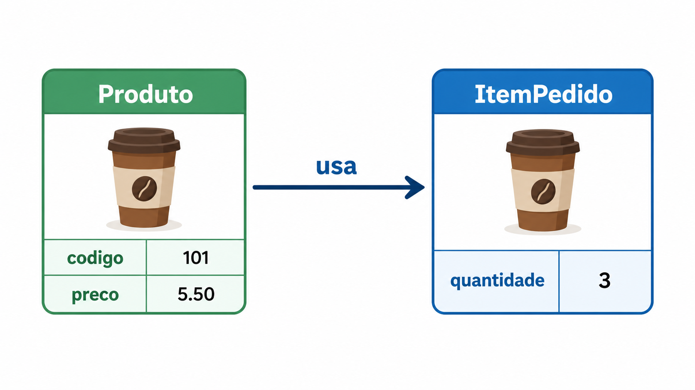
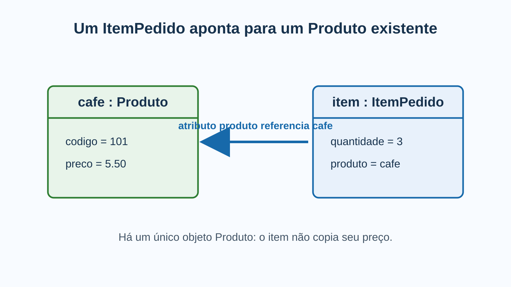
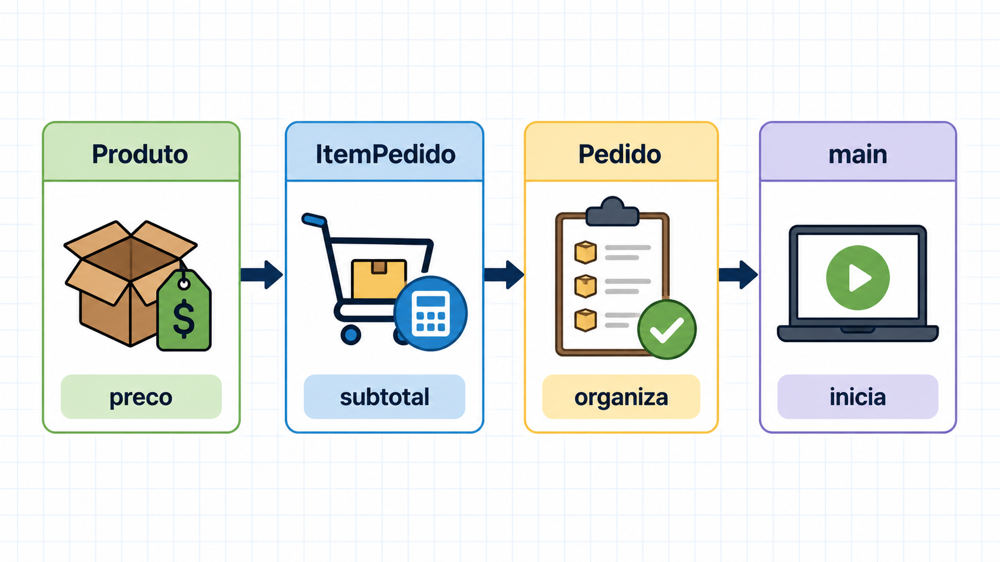
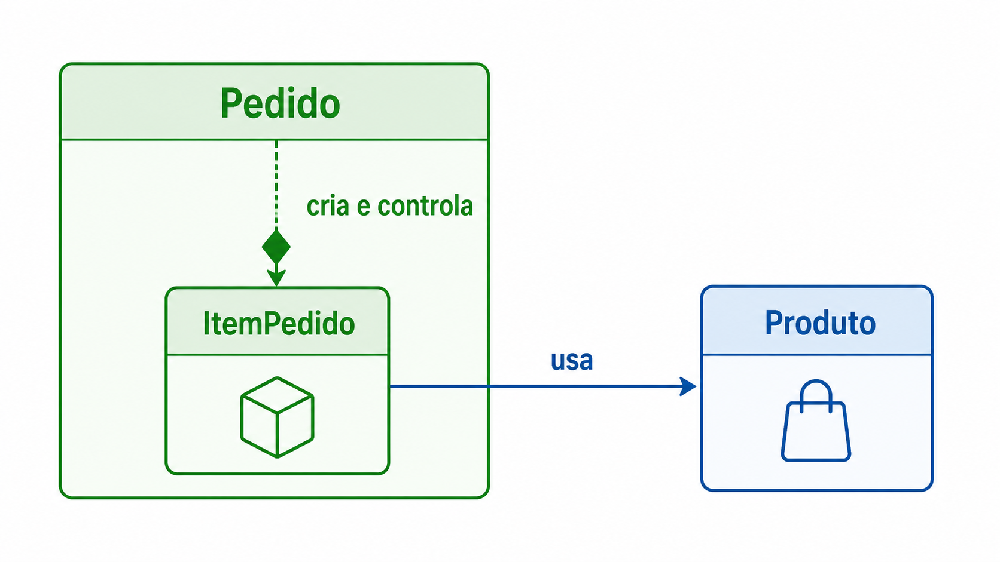
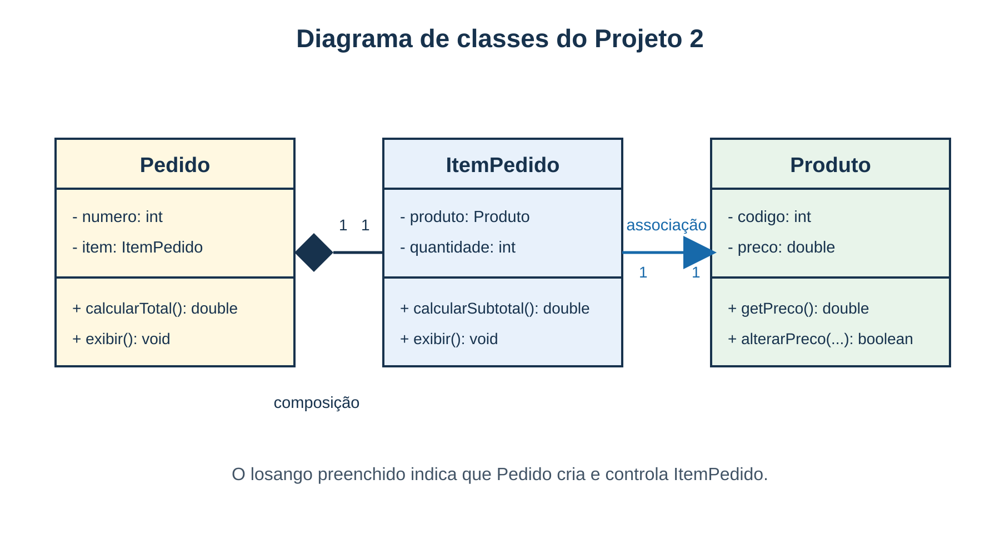
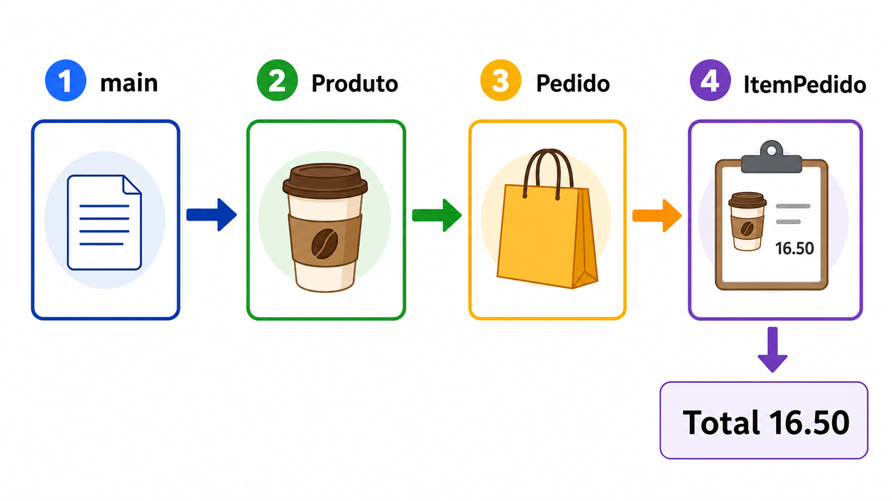
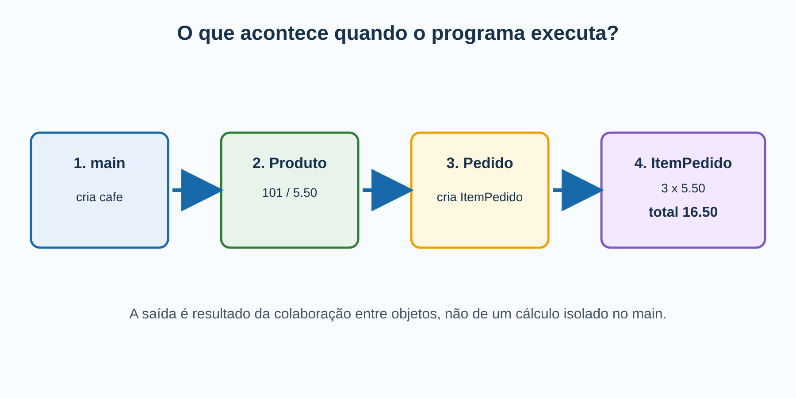

# 1. Encontro 7 — Relacionamentos e responsabilidades

**Projeto 2:** por que objetos precisam colaborar.

# 2. Antes do código: o que é o Projeto 2?

O Projeto 2 é um programa Java construído em etapas para representar pedidos de uma pequena cafeteria apenas em memória. Ele não é um sistema comercial completo: é um laboratório para aprender como objetos se relacionam e dividem responsabilidades.

# 3. Qual problema o projeto representa?

Uma cafeteria possui produtos. Ao comprar três cafés, surgem dados que não pertencem apenas ao café: quantidade da compra, número do pedido e total.

# 4. O vocabulário do problema

- `Produto`: algo que a cafeteria oferece para venda.
- `ItemPedido`: um produto escolhido em uma quantidade específica.
- `Pedido`: uma compra identificada por número e formada por seus itens.

Essas palavras descrevem o problema antes de se tornarem classes Java.

# 5. Uma história concreta

O café 101 custa 5.50. Ana abre o pedido 10 e compra três cafés. A compra deve mostrar produto, preço, quantidade, subtotal e total 16.50.

# 6. Por que Produto não guarda quantidade?

O mesmo café pode estar em duas compras diferentes: pedido 10 com três unidades e pedido 11 com uma. Quantidade é uma propriedade do café dentro de uma compra, não do catálogo.

# 7. A classe que falta

`ItemPedido` representa “este Produto nesta quantidade”. Ele liga o produto à quantidade específica e calcula o valor dessa linha da compra.

# 8. O papel de Pedido

Pedido representa a compra como um todo: guarda seu número, cria e controla o item desta versão, pede o subtotal ao item e apresenta o total ao usuário.

# 9. O que o programa fará hoje?

```text
1 - exibir o pedido
2 - alterar o preço do café
3 - alterar a quantidade comprada
0 - encerrar
```

# 10. Por que começar com um único item?

Um pedido real possui vários itens. Hoje há somente um para tornar os vínculos entre as três classes visíveis. No próximo encontro, `ArrayList` permitirá vários itens.

# 11. O que fica fora do recorte?

Não construiremos banco de dados, tela gráfica, cliente ou pagamento. Esses temas não ajudam a observar relacionamentos neste momento.

# 12. Como o Projeto 2 evoluirá?

- Encontro 7: um pedido, um item e um produto; relações e responsabilidades.
- Encontro 8: `ArrayList` e CRUD em coleção.
- Encontro 9: relações 1:1 e 1:N.
- Encontro 10: validações, `toString`, comparação e fechamento.

# 13. Produto esperado hoje

Programa executável que recalcula o total quando preço ou quantidade mudam. Cada regra deve ficar na classe que possui os dados necessários.

# 14. Do problema para os objetos

# 15. A tentativa procedural

```java
double preco = 5.50;
int quantidade = 3;
double total = preco * quantidade;
```

O problema não é a conta; é `main` concentrar dados e regras de objetos diferentes.

# 16. O que são relacionamentos?

Relacionamento é a ligação entre objetos quando um precisa guardar, usar ou pedir uma ação a outro para cumprir sua tarefa. Em Java, aparece como uma referência em um atributo.

# 17. O que eles resolvem?

Evitam copiar e espalhar dados. `ItemPedido` consulta o preço atual em `Produto`; assim, uma mudança de preço é feita em uma única fonte.

# 18. O que são responsabilidades?

Responsabilidade é aquilo que uma classe deve saber ou fazer porque possui os dados necessários. Ela define onde uma regra será escrita, testada e mantida.

# 19. Composição: por que existe?

Composição define quem cria e controla uma parte. Pedido cria seu ItemPedido; `main` não deixa o item solto sem saber a qual pedido pertence.

# 20. O programa em execução

O menu prova que a estrutura não é só desenho: opção 1 exibe 16.50; preço 6.00 altera o total para 18.00; quantidade 4 altera o total para 24.00.

# 21. Os conceitos em prática

As próximas seções mostram associação, responsabilidade, composição, UML, código e testes do programa.

# 3. O que já sabemos

`Produto` já controla código e preço, mas ainda não representa uma compra.

# 4. Situação de partida

Uma compra tem produto, preço, quantidade, número do pedido e total. Pergunta: todos esses dados pertencem ao mesmo objeto?

# 5. A solução que parece simples

```java
double preco = 5.50;
int quantidade = 3;
double total = preco * quantidade;
```

# 6. Qual problema essa solução cria?

O `main` concentra dados e regras de objetos diferentes. O preço pode ser copiado, desatualizado e a fórmula pode ser repetida.

# 7. Do produto isolado à compra

# 8. Definição: relacionamento entre objetos

Um relacionamento existe quando um objeto guarda, usa ou pede uma ação a outro objeto para cumprir sua tarefa. No código, ele aparece como referência.

# 9. Que problema um relacionamento resolve?

Evita valores ligados, porém soltos e duplicados. O item consulta o preço atual do produto em vez de guardar uma cópia.

# 10. Referência: o vínculo no código

```java
private final Produto produto;
```

Esse atributo aponta para um Produto existente; não é uma cópia do produto nem apenas seu código.

# 11. Associação: um objeto usa outro



Associação é o vínculo em que um objeto usa outro que pode existir independentemente.

# 12. Associação no projeto

`ItemPedido` usa um `Produto`. Se o pedido for removido, o produto continua existindo. Alterar o preço do produto atualiza o subtotal consultado pelo item.

# 13. Diagrama de objetos: associação em execução



`item.produto` aponta para o mesmo objeto `cafe`.

# 14. Construindo o vínculo passo a passo

```java
Produto cafe = new Produto(101, 5.50);
ItemPedido item = new ItemPedido(cafe, 3);
```

O construtor recebe a referência e a guarda em `this.produto`.

# 15. O construtor não copia o produto

```java
this.produto = produto;
```

Os dois lados referem-se ao mesmo objeto Produto.

# 16. Efeito observável da associação

Depois de `cafe.alterarPreco(6.00)`, `item.calcularSubtotal()` passa de 16.50 para 18.00 sem alterar ItemPedido.

# 17. Definição: responsabilidade

Responsabilidade é aquilo que uma classe deve conhecer ou fazer porque possui os dados necessários para isso.

# 18. Responsabilidades em uma compra



# 19. Distribuição das responsabilidades

- Produto: código, preço e validação de preço.
- ItemPedido: produto, quantidade, subtotal e validação de quantidade.
- Pedido: número, criação do item e delegação.
- main: cria objetos, lê opções e pede ações.

# 20. Onde fica a fórmula?

```java
return produto.getPreco() * quantidade;
```

`ItemPedido` possui os dois dados; por isso calcula subtotal.

# 21. Uma comparação importante

Quantidade não pertence a Produto: o mesmo café pode aparecer em quantidades diferentes. Total não pertence a `main`: a fórmula fica distante dos dados.

# 22. Composição: todo e parte

# 23. Definição: composição

Composição é relação de todo e parte quando o todo cria e controla uma parte que só faz sentido dentro dele.

# 24. Que problema a composição resolve?

Deixa claro quem cria e mantém a parte. `main` não monta um item solto; Pedido cria seu próprio ItemPedido.

# 25. Composição no pedido



# 26. Associação e composição

| Associação | Composição |
|---|---|
| ItemPedido usa Produto | Pedido controla ItemPedido |
| Produto existe sem item | Item pertence ao pedido |
| atributo de referência | criação interna |

# 27. Código da composição

```java
this.item = new ItemPedido(produto, quantidade);
```

Pedido cria a parte que controla.

# 28. Delegar preserva responsabilidades

```java
return item.calcularSubtotal();
```

Pedido pede o total ao item em vez de repetir a fórmula.

# 29. Do diagrama ao código e à execução

# 30. Diagrama de classes UML simplificado



# 31. Como ler o diagrama

Nome, atributos, operações, `-` privado, `+` operação pública, losango preenchido para composição, seta para associação e multiplicidade 1 neste recorte.

# 32. Do símbolo para Java

`ItemPedido ───► Produto` vira `private final Produto produto;`. `Pedido ◆── ItemPedido` vira `new ItemPedido(...)` dentro de Pedido.

# 33. O programa que vamos executar

```text
1-Exibir pedido 2-Alterar preco 3-Alterar quantidade 0-Sair
```

Há um único item nesta aula; vários itens entram com `ArrayList` no próximo encontro.

# 34. Ponto de partida em main

```java
Produto cafe = new Produto(101, 5.50);
Pedido pedido = new Pedido(10, cafe, 3);
```

# 35. Fluxo de execução



# 36. Fluxo de execução detalhado



# 37. Teste 1: exibir

Opção 1 exibe produto 101, preço 5.50, quantidade 3, subtotal 16.50 e total 16.50.

# 38. Teste 2: alterar preço

Opção 2 com 6.00 chama `cafe.alterarPreco(...)`; nova exibição mostra total 18.00.

# 39. Teste 3: alterar quantidade

Opção 3 com 4 chama `pedido.alterarQuantidade(...)`; nova exibição mostra total 24.00.

# 40. Prática guiada: ItemPedido

Complete referência, quantidade, alteração controlada, subtotal e exibição. Compile e teste opção 1.

# 41. Prática guiada: Pedido

Complete criação interna, delegação de quantidade, cálculo e exibição. Compile e teste opções 1 e 3.

# 42. Prática guiada: testes

Confira 16.50, 18.00 e 24.00. Preço 0 e quantidade 0 devem ser recusados, preservando valores anteriores.

# 43. Erros frequentes

Copiar preço para o item; calcular em `main`; colocar quantidade em Produto; criar ItemPedido fora de Pedido; acessar atributo privado diretamente.

# 44. Desafio e critério de conclusão

O menu deve funcionar e você deve localizar no código uma associação, uma composição e uma delegação; explicar por que o total não está no `main`.

# 45. Síntese e próximo encontro

Relacionamentos conectam objetos; associação usa objeto independente; composição controla parte; responsabilidade fica com os dados e a regra; delegação evita repetição. Próximo: vários itens com `ArrayList`.
