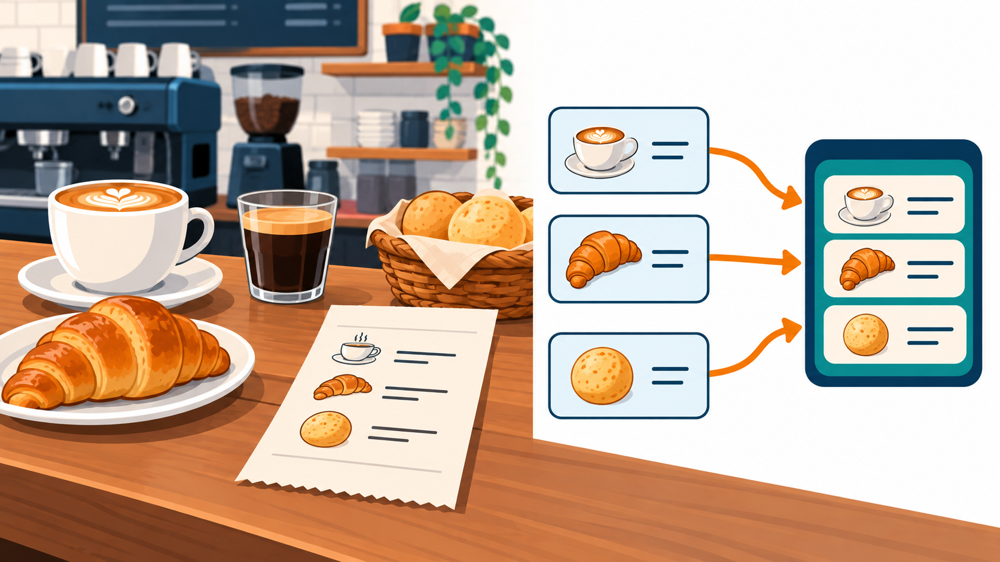
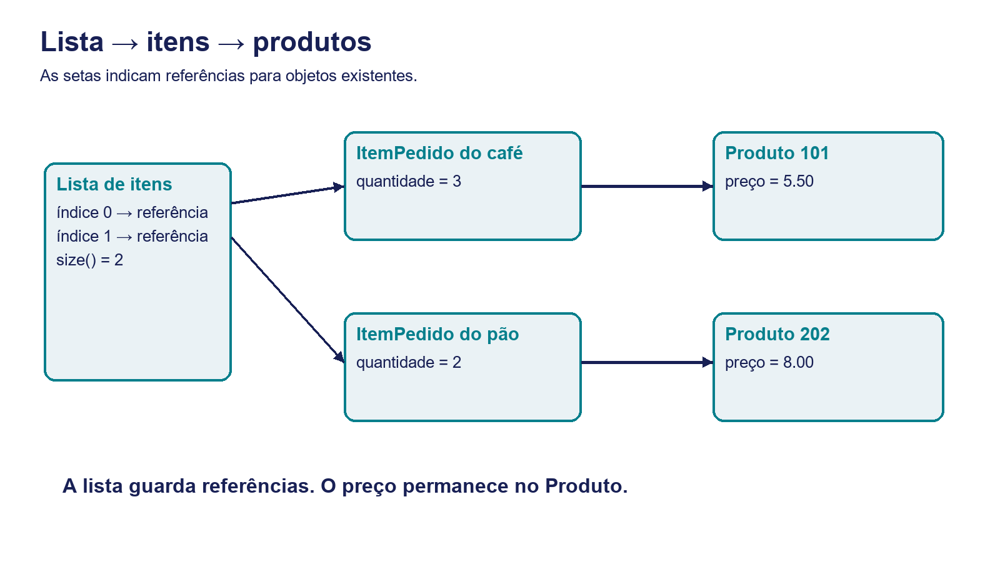
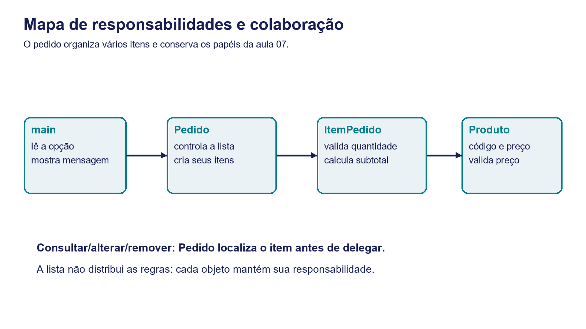
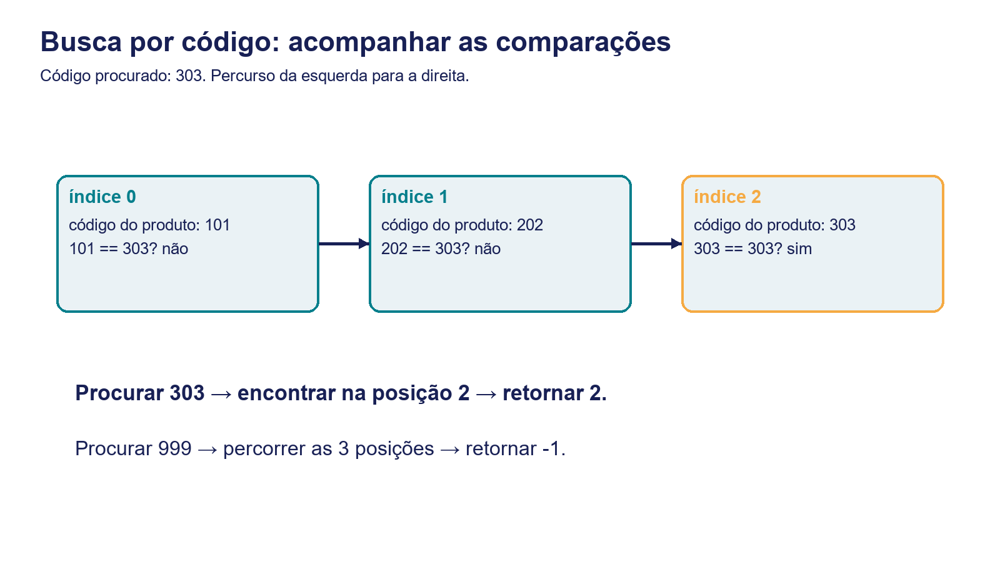
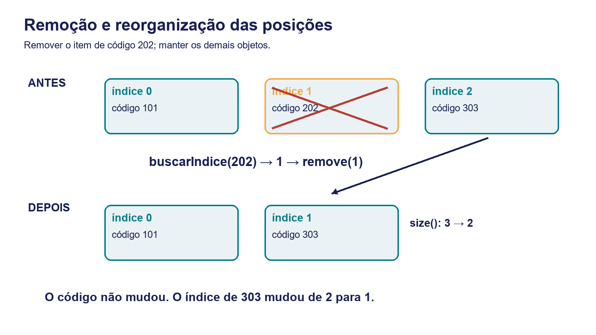
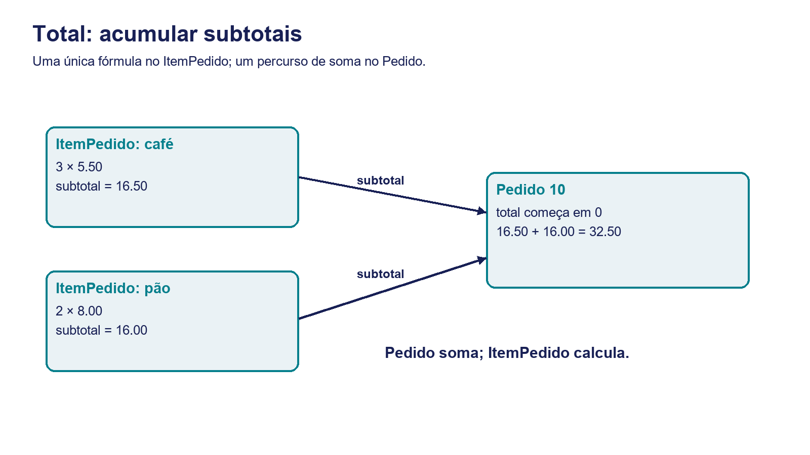
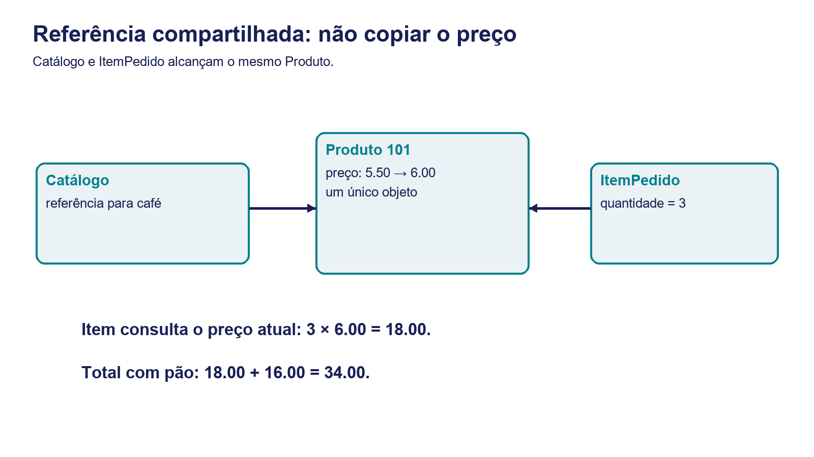

# Encontro 08 — Projeto 2: coleções e CRUD com ArrayList

Programação Orientada a Objetos

**De um item para uma lista de itens no pedido.**

Hoje vamos organizar vários objetos, realizar operações sobre a coleção e preservar as responsabilidades da aula 07.



---

# O que vamos construir hoje

- **Representação:** Pedido com uma lista de ItemPedido.
- **Operações:** incluir, consultar, alterar quantidade, remover e listar.
- **Resultado:** total calculado a partir de todos os itens.
- **Evidência:** programa executável e tabela de testes.

Ao final, você deverá distinguir código de índice e explicar como a lista mantém referências para os objetos.

---

# De onde partimos: o encontro 07

| Classe | O que sabe | O que faz |
|---|---|---|
| Produto | código e preço | protege alteração do preço |
| ItemPedido | produto e quantidade | calcula subtotal e valida quantidade |
| Pedido | número e um item | cria o item e delega ações |

**main** coordena o menu. O preço permanece no Produto; o item guarda uma referência para ele.

---

# O Projeto 2 no percurso da disciplina

1. **Encontro 07:** um pedido, um item; associação, composição e delegação.
2. **Encontro 08 — hoje:** lista de itens e CRUD com ArrayList.
3. **Encontro 09:** aprofundar relações 1:1 e 1:N e colaboração entre objetos.
4. **Encontro 10:** validações, toString e comparação; conclusão do projeto.

O domínio continua sendo uma pequena cafeteria, com dados apenas em memória.

---

# A limitação observável

**Versão anterior:** Pedido guarda somente `private final ItemPedido item;`.

- A compra de 3 cafés é representada corretamente.
- Se a mesma compra incluir pão, falta um lugar para o segundo item.
- Criar item1, item2 e item3 fixa outra quantidade arbitrária e repete operações.

**Pergunta central:** como representar uma quantidade variável de itens sem transferir as regras para main?

---

# Mapa do encontro

1. **Coleções:** lista, tipo, posições e operações básicas.
2. **Refatoração:** substituir um item por uma lista privada.
3. **Busca:** localizar o item pelo código do produto.
4. **CRUD:** validar, incluir, consultar, alterar e remover.
5. **Cálculos:** percorrer os itens e preservar referências.
6. **Prática e testes:** investigar erros e comprovar o resultado.

Cada bloco combina explicação, representação visual e uma verificação.

---

# O que muda e o que permanece

| Muda | Permanece |
|---|---|
| um item → lista de itens | Produto controla o preço |
| consulta única → busca por código | ItemPedido controla quantidade e subtotal |
| criação no construtor → inclusão no pedido | Pedido cria e controla seus itens |
| total de um item → soma de subtotais | dados em memória e preço atual compartilhado |

Catálogo fixo: 101/café/5.50, 202/pão/8.00, 303/suco/4.00. Cada código aparece no máximo uma vez no pedido; quantidade e preço devem ser positivos. Exemplo fictício.

---

# 1. Coleções: organizar vários objetos

**Da quantidade fixa para uma sequência variável.**

Neste bloco: conceito de lista, comparação com arrays, declaração tipada e operações básicas.

Ao terminar, você deverá criar uma lista e prever o efeito de uma remoção.

---

# Antes do código: várias linhas em uma compra

Na cafeteria, cada linha do pedido reúne um produto escolhido e sua quantidade.

- **Café:** código 101, preço 5.50, quantidade 3.
- **Pão:** código 202, preço 8.00, quantidade 2.
- **Pedido 10:** precisa organizar ambas as linhas.

O número de linhas depende da compra; não pertence ao Produto. A lista será o recipiente dessas referências.


---

# Coleção e lista: o significado dos termos

- **Coleção:** estrutura que reúne elementos para armazenar e consultar.
- **Lista:** coleção que mantém uma sequência de posições.
- **Elemento:** cada objeto referenciado em uma posição da lista.
- **Índice:** número da posição, começando em zero.

**ArrayList** implementa uma lista cuja capacidade de armazenamento é ajustada automaticamente. Não é ilimitada: usa a memória disponível.

---

# Array e ArrayList: o trabalho que muda

| Array de objetos | ArrayList |
|---|---|
| tamanho definido na criação | capacidade interna ajustada automaticamente |
| length informa quantidade de posições | size() informa quantidade de elementos |
| controlar ocupação manualmente | add inclui e atualiza o tamanho |
| deslocar referências na remoção | remove reorganiza as posições |
| vetor[i] | lista.get(i) |

A lista simplifica o armazenamento. As regras de preço, quantidade e duplicidade continuam sendo do projeto.

---

# Criar uma lista tipada: passo a passo


```java
import java.util.ArrayList;
ArrayList<Produto> produtos = new ArrayList<>();
```

1. **import:** permite usar ArrayList pelo nome curto.
2. **ArrayList<Produto>:** só permite elementos compatíveis com Produto.
3. **produtos:** variável que guarda a referência para a lista.
4. **new ArrayList<>():** cria uma lista vazia; o <> reaproveita o tipo da esquerda.

Criar a lista não cria nenhum Produto; size() começa em zero.

---

# List e ArrayList: ler a declaração


```java
import java.util.List;
import java.util.ArrayList;
List<ItemPedido> itens = new ArrayList<>();
```

- **List:** interface da biblioteca que descreve operações de lista.
- **ArrayList:** classe concreta usada para criar o objeto.
- **ItemPedido:** tipo de elemento permitido.

Não podemos instanciar `new List<>()`. Usaremos a declaração pronta; interfaces próprias e polimorfismo serão aprofundados depois.

---

# Operações básicas: o vocabulário da lista

| Operação | Efeito |
|---|---|
| add(elemento) | acrescenta no fim |
| size() | informa quantos elementos existem |
| isEmpty() | indica se não há elementos |
| get(indice) | recupera a referência na posição |
| set(indice, elemento) | substitui a referência na posição |
| remove(indice) | remove a posição e reorganiza a sequência |

ArrayList permite repetições; impedir produto duplicado exige uma regra nossa.

---

# Inclusão e leitura: acompanhar cada passo


```java
Produto cafe = new Produto(101, 5.50);
Produto pao = new Produto(202, 8.00);
List<Produto> produtos = new ArrayList<>();
produtos.add(cafe);
produtos.add(pao);
System.out.println(produtos.size());
System.out.println(produtos.get(0).getCodigo());
```

- Após o primeiro add: existe um elemento.
- Após o segundo add: existem dois elementos.
- get(0) acessa a primeira posição, onde está o café.

**Antes de executar:** registre as duas saídas esperadas.

---

# Índice não é código do produto

| Índice da lista | Código do produto |
|---|---|
| 0 | 101 |
| 1 | 202 |

- `get(1)` acessa a segunda posição: código 202.
- `get(202)` tenta acessar a posição 202, que não existe nesta lista.
- Para size() = 2, somente 0 e 1 são válidos: `0 <= indice < size()`.

O índice localiza uma posição; o código identifica um produto do domínio.

---

# O que a lista guarda: referências

- Cada posição guarda uma referência para um ItemPedido.
- Cada ItemPedido guarda quantidade e referência para Produto.
- O preço continua apenas no Produto.

**Leia as setas:** a posição permite alcançar o item; o item permite alcançar o produto. A lista não cria cópias dos objetos.



---

# Prática 1 — A lista em movimento

**Em dupla — 8 minutos.**

1. Crie uma lista tipada de Produto.
2. Adicione café 101 e pão 202.
3. Mostre size() e o código de get(0).
4. Remova a posição zero e mostre os mesmos dados novamente.

**Entrega:** quatro linhas de saída e previsão anterior à execução.
**Critério:** explicar a mudança de posição e distinguir retirar referência de alterar Produto.

---

# 2. Refatorar Pedido: trocar a estrutura

**A coleção passa a pertencer ao pedido.**

Neste bloco: antes/depois do atributo, responsabilidades e proteção da lista.

A mudança deve permitir vários itens e conservar as regras aprendidas.

---

# De um atributo para uma lista privada

**Antes — encontro 07**
```java
private final ItemPedido item;
```
**Depois — encontro 08**
```java
private final List<ItemPedido> itens = new ArrayList<>();
```
- Pedido nasce com uma lista vazia.
- Cada inclusão cria um novo ItemPedido dentro de Pedido.
- As classes Produto e ItemPedido continuam com seus papéis.

As novas operações ficam em Pedido; main chama essas operações.

---

# Mapa de colaboração: vários itens, mesmos papéis

- **main → Pedido:** solicita uma operação.
- **Pedido → ItemPedido:** localiza o item e delega.
- **ItemPedido → Produto:** consulta código e preço.

Pedido continua criando suas partes. Produto continua independente no catálogo. A formalização das multiplicidades será aprofundada no encontro 09.



---

# Quem deve fazer cada operação?

| Operação | Responsável | Por quê? |
|---|---|---|
| adicionar/remover item | Pedido | controla a coleção |
| buscar item por código | Pedido | conhece seus itens |
| alterar quantidade | ItemPedido | protege sua quantidade |
| calcular subtotal | ItemPedido | reúne produto e quantidade |
| alterar preço | Produto | controla seu preço |
| ler opção e mostrar mensagem | main | coordena o menu |

**Verificação:** explique por que o preço não deve ser copiado para cada item.

---

# private e final: proteções diferentes


```java
class Pedido {
    private final int numero;
    private final List<ItemPedido> itens = new ArrayList<>();
    Pedido(int numero) { this.numero = numero; }
}
```

- **private:** impede que main acesse diretamente a lista interna.
- **final:** impede trocar a referência para outra lista.
- **add/remove:** continuam permitidos; a lista não fica congelada.

Não devolveremos a coleção interna ao main. Pedido oferece métodos que validam as mudanças.

---

# 3. Busca: encontrar o item pelo código

**Antes de consultar, alterar ou remover, precisamos localizar.**

Neste bloco: contrato de buscarIndice, percurso sequencial e tratamento da ausência.

O código será a entrada; o índice será um resultado temporário.

---

# Contrato da busca: entrada e retorno

- **Entrada:** código do Produto, por exemplo 202.
- **Retorno encontrado:** índice do ItemPedido correspondente.
- **Retorno ausente:** -1.
- **Visibilidade:** método privado de Pedido; apoio às operações.

O item permite consultar o código sem expor seu atributo produto:
```java
int getCodigoProduto() {
    return produto.getCodigo();
}
```

-1 é um sinal de ausência; nunca deve ser usado diretamente em get.

---

# Busca linear: construir o percurso


```java
private int buscarIndice(int codigo) {
    for (int i = 0; i < itens.size(); i++) {
        if (itens.get(i).getCodigoProduto() == codigo) return i;
    }
    return -1;
}
```

1. Comece na posição zero.
2. Continue enquanto i for menor que size().
3. Compare o código do produto do item com o código procurado.
4. Encerre ao encontrar; se acabar a lista, retorne -1.

contains(codigo) não faz essa busca: a lista contém ItemPedido, não inteiros.

---

# Rastrear a busca: código 303

A lista contém códigos 101, 202 e 303, nesta ordem.

- Em i = 0: comparar 101 com 303.
- Em i = 1: comparar 202 com 303.
- Em i = 2: comparar 303 com 303 e encerrar.

**Contraste:** procurar 999 exige percorrer todos os itens e retornar -1. A busca não modifica a lista.



---

# Prática 2 — Encontrado e ausente

**Em dupla — 7 minutos.**

1. Desenhe a lista [101, 202, 303].
2. Rastreie a busca de 303 e de 999.
3. Registre i, código consultado, comparação e retorno.

**Entrega:** duas tabelas de rastreamento.
**Critério:** parar ao encontrar; retornar -1 após percorrer toda a lista; manter o estado intacto.

---

# 4. CRUD: modificar com controle

**Buscar, validar e somente depois agir.**

Neste bloco: inclusão, consulta, alteração de quantidade e remoção.

A coleção cuida das posições. Os objetos cuidam das regras do pedido.

---

# CRUD aplicado ao pedido

| Letra | Operação | Método do projeto |
|---|---|---|
| C — Create | incluir um item | adicionarItem(produto, quantidade) |
| R — Read | consultar/listar | consultarItem(codigo), exibir() |
| U — Update | alterar quantidade | alterarQuantidade(codigo, valor) |
| D — Delete | remover um item | removerItem(codigo) |

Retorno boolean: true indica sucesso; false indica recusa ou ausência. main interpreta o resultado e mostra a mensagem.

---

# Inclusão: verificar antes de mudar

1. **Produto encontrado?** null indica que o catálogo não localizou o produto.
2. **Quantidade positiva?** zero e negativo devem ser recusados.
3. **Código já está no pedido?** repetição deve ser recusada.
4. **Condições satisfeitas?** criar o item e adicionar no fim.

A recusa deve preservar tamanho e total. Repetição não soma quantidade nesta versão.

Com `||`, se produto for null, a condição encerra sem acessar getCodigo().

---

# Inclusão: criação e armazenamento


```java
boolean adicionarItem(Produto produto, int quantidade) {
    if (produto == null || quantidade <= 0) return false;
    if (buscarIndice(produto.getCodigo()) != -1) return false;
    itens.add(new ItemPedido(produto, quantidade));
    return true;
}
```

- **new ItemPedido:** Pedido cria sua parte.
- **add:** armazena a referência no fim da lista.
- **true:** confirma que a inclusão ocorreu.

Produto já existia no catálogo; incluir o item não cria outro Produto.

---

# Consulta: proteger o valor -1


```java
boolean consultarItem(int codigo) {
    int indice = buscarIndice(codigo);
    if (indice == -1) return false;
    itens.get(indice).exibir();
    return true;
}
```

1. Buscar o código.
2. Se retornar -1, encerrar com false.
3. Caso contrário, pedir a exibição ao item encontrado.

Consulta não altera lista nem quantidade. main informa quando o item não foi encontrado.

---

# Prática 3 — Incluir e consultar

**Em dupla — 12 minutos.**

1. Complete buscarIndice, adicionarItem e consultarItem no arquivo inicial.
2. Compile antes de continuar.
3. Liste vazio; inclua 101/3 e 202/2; consulte os dois códigos.
4. Tente repetição, quantidade zero e consulta de 999.

**Entrega:** estado exibido e registro de recusas.
**Critério:** inclusão válida aumenta size em um; recusa não altera estado; ausência não acessa get(-1).

---

# Atualização: alterar o objeto existente


```java
boolean alterarQuantidade(int codigo, int novaQuantidade) {
    int indice = buscarIndice(codigo);
    if (indice == -1) return false;
    return itens.get(indice).alterarQuantidade(novaQuantidade);
}
```

- Pedido busca o item.
- ItemPedido valida a nova quantidade.
- A referência na lista permanece a mesma.

Se quantidade for inválida, o método do item retorna false e preserva o valor anterior.

---

# set e alteração de atributo são diferentes


```java
produtos.set(0, outroProduto);
produtos.get(0).alterarPreco(6.00);
```

| Ação | O que muda? |
|---|---|
| set(0, outroProduto) | referência armazenada na posição zero |
| get(0).alterarPreco(6.00) | estado do objeto já referenciado |

No pedido, usamos alterarQuantidade para modificar o item existente. **Em dupla:** explique o que permanece em cada operação.

---

# Remoção: localizar, verificar e retirar


```java
boolean removerItem(int codigo) {
    int indice = buscarIndice(codigo);
    if (indice == -1) return false;
    itens.remove(indice);
    return true;
}
```

1. Converter código em índice por meio da busca.
2. Recusar a ausência antes de remove.
3. Remover a posição encontrada.

remove(int) interpreta o argumento como índice. `remove(202)` não procura automaticamente o produto de código 202.

---

# Depois da remoção: posições se reorganizam

**Ação:** remover o código 202, encontrado na posição 1.

- Antes: 0 → 101; 1 → 202; 2 → 303.
- Depois: 0 → 101; 1 → 303.
- O código 303 permanece; o índice passa de 2 para 1.

Busque novamente a cada operação. Remover o item não remove o Produto do catálogo. Primeiro buscamos; depois removemos fora do laço.



---

# Prática 4 — Atualizar e remover

**Em dupla — 15 minutos.**

1. Complete alterarQuantidade e removerItem.
2. Use 101/3, 202/2 e 303/1.
3. Consulte 202; altere sua quantidade; remova 101.
4. Consulte 101 e altere 303 após o deslocamento.

**Entrega:** estados antes/depois e duas operações com código ausente.
**Critério:** alcançar 303 na nova posição, preservar quantidade inválida e evitar get(-1).

---

# 5. Percorrer a lista: exibir e calcular

**Uma lista de objetos exige colaboração, não fórmulas duplicadas.**

Neste bloco: soma de subtotais, listagem, for-each e referências compartilhadas.

O pedido pergunta a cada item quanto ele vale.

---

# Total do pedido: somar os resultados dos itens

**Pedido 10:**

- Item do café: 3 × 5.50 = 16.50.
- Item do pão: 2 × 8.00 = 16.00.
- Total: 16.50 + 16.00 = 32.50.

ItemPedido calcula o subtotal. Pedido acumula os subtotais. main apenas solicita a exibição.



---

# Acumulador: percorrer e somar


```java
double calcularTotal() {
    double total = 0;
    for (int i = 0; i < itens.size(); i++) {
        total += itens.get(i).calcularSubtotal();
    }
    return total;
}
```

1. Iniciar total em zero em cada chamada.
2. Percorrer índices de zero até size() - 1.
3. Pedir o subtotal ao item e somar.
4. Devolver o resultado.

Lista vazia não executa o laço e retorna 0. Não armazenaremos um total que possa ficar desatualizado.

---

# Listagem: delegar a exibição


```java
if (itens.isEmpty()) System.out.println("Pedido vazio.");
for (int i = 0; i < itens.size(); i++) {
    itens.get(i).exibir();
}
System.out.printf("Total: %.2f%n", calcularTotal());
```

- isEmpty permite informar pedido vazio.
- O percurso solicita a exibição de cada item.
- calcularTotal consulta a mesma lista.

O método completo de Pedido também mostra número do pedido e quantidade de itens.

---

# for-each: quando a posição não é necessária


```java
for (ItemPedido item : itens) {
    total += item.calcularSubtotal();
}
```

- Leia: para cada ItemPedido item da lista itens.
- item recebe uma referência por vez.
- É útil para leitura, exibição e soma.
- Não alterar a estrutura da lista durante esse percurso.

O programa principal conserva for com índice para retomar a experiência com arrays.

---

# Preço compartilhado: a referência foi preservada

**Ação:** alterar o preço do café de 5.50 para 6.00 no catálogo.

- O ItemPedido continua ligado ao mesmo Produto.
- Subtotal do café: 3 × 6.00 = 18.00.
- Subtotal do pão: permanece 16.00.
- Total passa de 32.50 para 34.00.

Não copiamos preço. Este projeto usa preço atual; preço histórico de uma venda real está fora do recorte.



---

# Testes do exemplo guiado

| Sequência | Total esperado |
|---|---|
| pedido vazio | 0.00 |
| incluir 101/3 | 16.50 |
| incluir 202/2 | 32.50 |
| preço de 101 → 6.00 | 34.00 |
| quantidade de 202 → 1 | 26.00 |
| remover 101 | 8.00 |
| remover 202 | 0.00 |

**Preveja antes de executar.** Repetição e quantidade zero devem preservar tamanho e total.

---

# Menu final e limites desta etapa

| Opção | Ação | Opção | Ação |
|---|---|---|---|
| 1 | listar pedido | 5 | remover item |
| 2 | incluir item | 6 | alterar preço |
| 3 | consultar item | 7 | mostrar catálogo |
| 4 | alterar quantidade | 0 | sair |

- Catálogo pequeno e fixo em array; itens variáveis em ArrayList.
- Códigos e quantidades inteiros; preços com ponto.
- Entrada textual inválida ainda não é tratada; exceções ficam para depois.
- Ao sair, os dados em memória se perdem.

---

# 6. Prática integradora e verificação

**Da execução guiada para uma solução que você consegue testar.**

Neste bloco: investigação de uma remoção incorreta, conclusão dos TODOs e comparação com a aula 07.

Produto final: código Java, tabela de testes e justificativa das decisões.

---

# Investigação — O caixa retirou o item errado

**Em dupla — 12 minutos, dentro do laboratório de 28 minutos.**

Um caixa escreveu `itens.remove(codigo)` e testou uma versão de rascunho com código 0. Parecia funcionar.

1. Investigue o que o teste inicial escondia.
2. Experimente os códigos reais 101, 202 e 303.
3. Proponha uma correção e um teste que demonstre a falha.
4. Depois de remover o intermediário, consulte e altere o último.

**Entrega:** diagnóstico, trecho corrigido e evidência de estado. O código 0 pertence somente ao rascunho defeituoso.

---

# Laboratório — Finalizar um pedido confiável

**Em dupla — 28 minutos no total: 12 de investigação + 16 de conclusão.**

- Conclua os TODOs de ProjetoPedidoListaInicial.java.
- Valide todas as opções do menu.
- Registre teste de duplicidade, ausência e quantidade inválida.
- Confira remoções e preço compartilhado.

**Entrega:** Java, tabela de testes e justificativa de índice/código e responsabilidades.
**Critério:** CRUD completo, recusas preservam estado e pedido vazio retorna zero. Respostas serão discutidas após a tentativa.

---

# Tabela de evidências: testar o estado

| Entrada | Estado antes | Esperado | Observado | Conclusão |
|---|---|---|---|---|
| preencha | preencha | preveja | execute | compare |

Teste: excluir primeiro/intermediário/último; remover todos; incluir novamente; código 999; preço zero; opção desconhecida.

- Não basta a mensagem de sucesso: confira itens e total.
- Se falhar, corrija e repita o menor caso que revela a falha.
- Sem computador: desenhe posições/códigos e rastreie os métodos em papel.

---

# Refatoração: comparar com a aula 07

**Repita o caso anterior com somente o café:**

1. Código 101, quantidade 3, preço 5.50 → 16.50.
2. Preço 6.00 → 18.00.
3. Quantidade 4 → 24.00.

Depois, acrescente outros produtos.

**Explique:** qual limitação desapareceu? Quais responsabilidades e regras permaneceram? A comparação comprova a preservação do comportamento anterior.

---

# Registrar a evolução no Git

Compile e execute os testes antes do commit. Use o repositório próprio do Projeto 2.

```shell
git add .
git commit -m "Evolui pedido com lista e CRUD de itens"
git push
```

- Registre uma mudança que funciona e foi testada.
- Sem Internet, mantenha o commit local e faça push posteriormente.
- Não misture o projeto com o repositório de exercícios.

---

# Síntese: o que aprendemos

- **Lista:** sequência de referências, com índices a partir de zero.
- **List/ArrayList:** operações declaradas pela interface; armazenamento implementado pela classe.
- **Busca:** converte código do produto em índice temporário.
- **CRUD:** valida antes de mudar o estado.
- **Delegação:** cada item calcula subtotal; Pedido soma.
- **Encapsulamento:** Pedido mantém a coleção sob seu controle.

---

# Saída individual e próximo encontro

**Sem consultar a dupla, responda:**

1. Por que remove(202) não procura necessariamente o código 202?
2. Como atualizar quantidade sem set?
3. O que final protege na declaração da lista?
4. Escreva um teste de ausência após remover o primeiro item.

**Encontro 09:** aprofundaremos relações 1:1 e 1:N usando a lista funcional de hoje.
